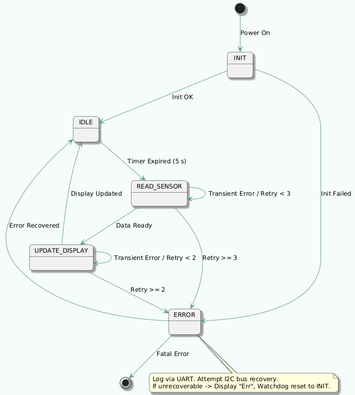

## Week 1 — Day 3
**Date:** 2025-09-03  
**Phase:** Specification & Architecture  
**Module(s):** Documentation & State Diagrams  

**Tasks & Results:**

* Created `Doc/Diagrams/` folder to store **PlantUML** sources and exported diagrams.
* Basic requirements and high-level architecture drafted (see: `requirements.md`, `architecture.md` in `Doc/`).
* Created **PlantUML** diagrams and placed sources/[exports](https://www.planttext.com) (see: `Doc/Diagrams/`):
  - `fw_logic_fsm_v.1.0.puml` (and `.png`) — system state machine (Init -> Idle -> Read Sensor -> Update Display -> Error):  
  
  
  
  - `fw_architecture_v.1.0.puml` (and `.png`) — layered architecture (Application, Device Drivers, Peripheral Drivers, Board Support, System Layer):  
  
  

**Next Steps:**

* Verify toolchain, build system, and development board with a simple test program.
