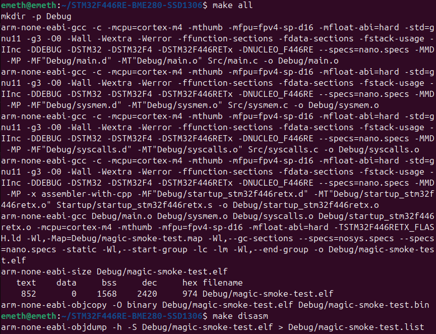
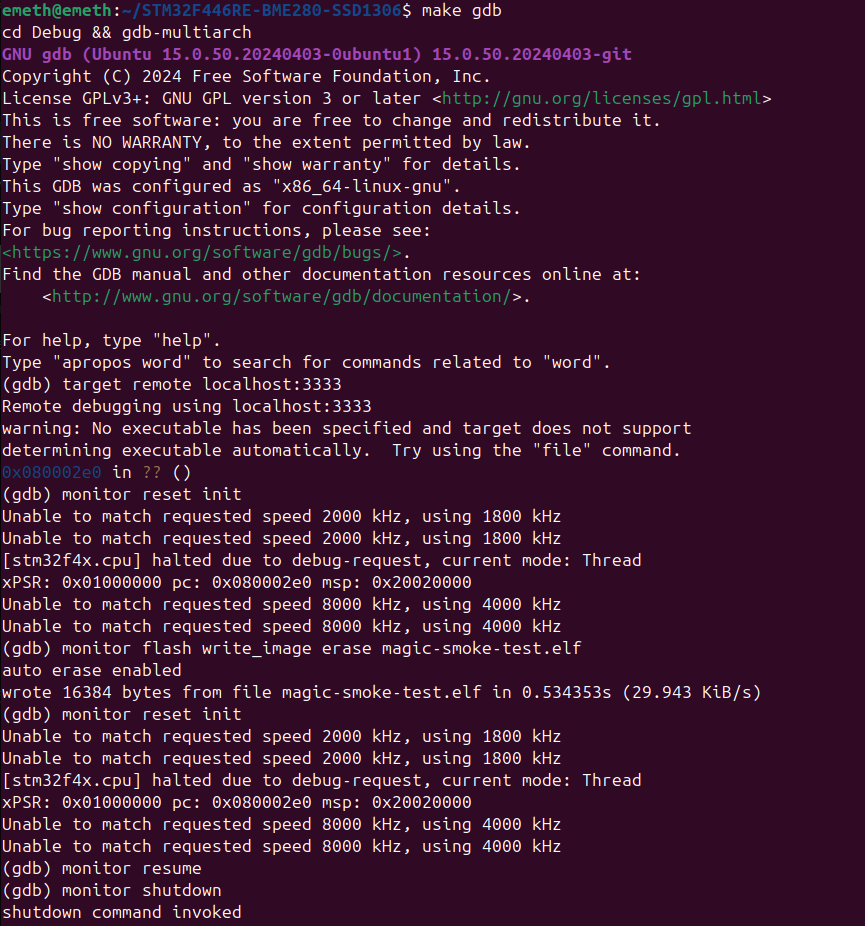

## Week 1 — Day 4
**Date:** 2025-09-06  
**Phase:** Toolchain & Board Smoke Test  
**Module(s):** System Files & Build System  

**Tasks & Results:**

* Makefile updated — finalized build and debug/flash targets (`all`, `disasm`, `clean`, `ocd`, `gdb`).
* Verified build process — all sources compile and link, binary generated successfully.

* Verified debug and flashing workflow via **OpenOCD** and **GDB**:

  * **OpenOCD** launched and **GDB** connected via port `3333`:
  
  
  
  * Debug session commands executed step by step:
  
  

    1. Connect to the MCU: `target remote localhost:3333`,
    2. Reset/init device: `monitor reset init`,
    3. Flash new firmware: `monitor flash write_image erase magic-smoke-test.elf`,
    4. Reset again: `monitor reset init`,
    5. Resume execution: `monitor resume`,
    6. Exit session.

* Development board successfully programmed and verified. Full toolchain + board operation confirmed.

**Next Steps:**

* Configure **UART** and implement single-byte transmission.
