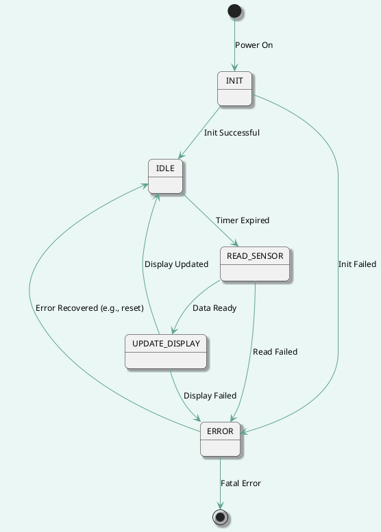
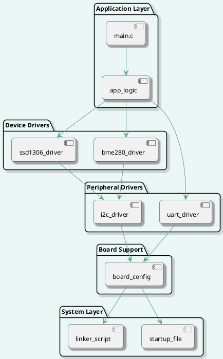

## Date: 2025-09-03

### Stage 1 — Specification & Architecture

**Tasks & Results:**

* Repository structure updated:
  
  * Created `Doc/Diagrams` to store PlantUML sources and exported diagrams.

* Added system source files in `Src/`:
  
  * `syscalls.c` — minimal newlib syscall stubs (`_write`, `_close`, `_fstat`, `_isatty`, `_lseek`, `_read`, etc.).
  * `sysmem.c` — preliminary `_sbrk` implementation / heap management shim.

* Added RAM-focused linker script in `Sys/`:
  
  * `STM32F446RETX_RAM.ld` — linker script variant configured for execution from SRAM (VMA/LMA mapping adjusted).

* Requirements and high-level architecture drafted:
  
  * Documented subsystem responsibilities, module boundaries and public interfaces (drafts in `Doc/`).

* Created PlantUML diagrams and placed sources/[exports](https://www.planttext.com) in `Doc/Diagrams`:
  
  * `fw_logic_fsm_v.1.0.puml` — system state machine (Init → Idle → Read Sensor → Update Display → Error).
  * `fw_architecture_v.1.0.puml` — layered architecture (Application, Device Drivers, Peripheral Drivers, Board Support, System Layer).

* Preliminary `Makefile` added to project root:
  
  * Targets: `make`/`make all` (build), `make flash` (build + flash), `make clean` (clean build artifacts).

**Technical notes (important for next actions):**

* The `make flash` recipe is left generic; concrete programmer integration (OpenOCD, ST-LINK, STM32CubeProgrammer CLI, or `st-flash`) must be configured per developer environment.

**Next Steps:**

* Attempt a full build (`make all`), capture and fix compilation / linkage issues (symbols, include paths, linker script mismatches).

* Verify `_sbrk`/syscalls behaviour under newlib: run a simple test that exercises `malloc` and UART/printf output.

* Flash to board and validate basic runtime:
  
  * Confirm correct reset handler execution, vector table placement and basic peripheral bring-up.
  * Verify UART output (boot banner) and, if available, I2C scan / simple read to validate peripheral drivers.

* Refine specification: finalise API contracts for drivers (BME280, SSD1306, I2C, UART) and error semantics.

---

### PlantUML sources (copied to `Doc/Diagrams`)

**fw_logic_fsm_v.1.0.puml**

**fw_architecture_v.1.0.puml**

