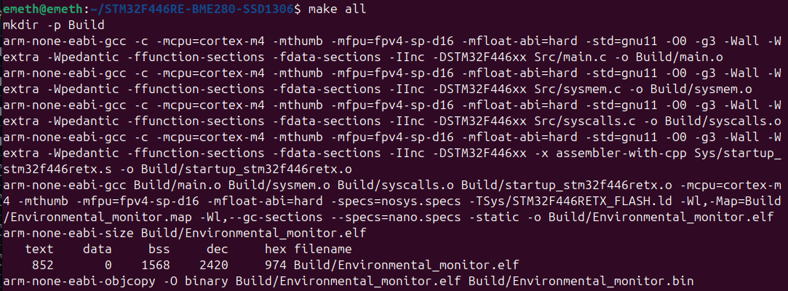

## Date: 2025-09-04

### Stage 0 — Preparation & Init

**Tasks & Results:**

* Documentation files updated (proofreading).
* Makefile updated (dependency); build tested successfully.

**Next Steps:**

* Complete testing of debugging and flashing tools (OpenOCD and GDB), verify development board operation.
* Implement UART output for setup messages in Minicom and transmit a test character.
* Refine state diagrams, and improve requirements and firmware architecture documents.
