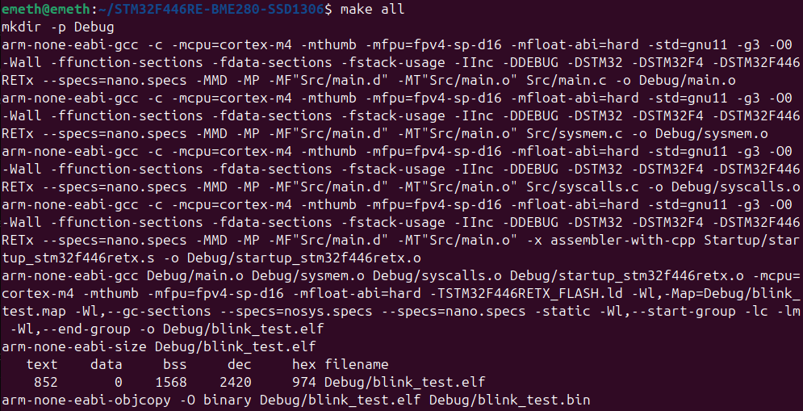

## Week 1 — Work Day 5
**Date:** 2025-09-05  
**Phase:** Preparation & Init  

**Tasks & Results:**

* Repository structure updated to standard STM project layout (`/Src`, `/Inc`, `/Startup`, `/Debug`).
* Makefile improved:
  * All build targets (`.elf`, `.bin`) compile successfully.
  * Object and binary files are generated in the `Debug` folder.
  * Dependency files `.d` correctly handled.
* Build tested successfully — compilation and linking pass without errors.

**Next Steps:**

* Test OpenOCD flashing and GDB debugging, verify operation of the development board.
* Implement UART output for setup messages in Minicom and transmit a test character.
* Refine state diagrams and continue improving requirements and firmware architecture documentation.
