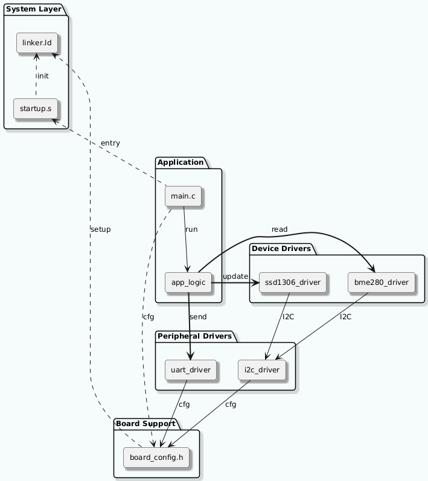

## Firmware Architecture: Environmental Monitor

**Version:** 1.0  
**Date:** 2025-09-03  
**Author:** Timofei Alekseenko

## 1. Architectural Overview

The system follows a layered, modular architecture to promote separation of concerns and testability.

## 2. Layer Diagram

* Application Layer (`app_logic.c`, `main.c`).
* Device Drivers (`bme280.c`, `ssd1306.c`).
* Peripheral Drivers (`i2c_lowlevel.c`, `uart_lowlevel.c`).
* Board Support Package (`board_config.h`).
* System Layer (Startup File, Linker Script).

## 3. Module Description

* **System Layer:** Handles MCU startup, interrupt vector table, and memory layout.
* **Board Support Package (BSP):** `board_config.h`. Centralizes hardware-specific configuration (pin mappings, peripheral addresses, clock settings).
* **Peripheral Drivers:**
  * `i2c_lowlevel.c`: Low-level I²C functions (`init`, `read`, `write`).
  * `uart_lowlevel.c`: Low-level UART functions (`init`, `putchar`, `puts`).
* **Device Drivers:**
  * `bme280.c`: Implements the BME280 sensor protocol. Depends on `i2c_lowlevel.c`.
  * `ssd1306.c`: Implements the SSD1306 display controller protocol. Depends on `i2c_lowlevel.c`.
* **Application Logic:** `app_logic.c`. Contains the main state machine and coordination logic (e.g., read sensor -> update display -> wait).
* **Main:** `main.c`. Initializes all modules and starts the main loop.

## 4. Dataflow

1. Startup code runs -> `main()` is called (after the `ENTRY(Reset_Handler)` directive).
2. `main()` initializes BSP, peripherals, devices.
3. `main()` enters loop, calls `app_process()`.
4. `app_process()` triggers sensor read via `bme280_read()`.
5. `bme280_read()` uses `i2c_read()`.
6. Data is formatted and sent to display via `ssd1306_display()`.
7. Data is also sent via UART to Minicom for verification and fine-tuning tasks.
8. `ssd1306_display()` uses `i2c_write()`.
9. Loop repeats after a delay.
