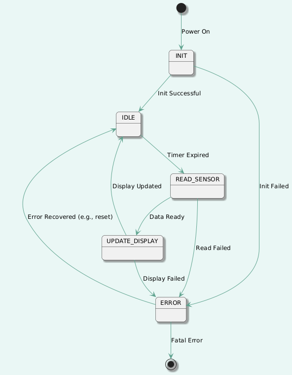

## Project Specification: Environmental Monitor

**Version:** 1.0  
**Date:** 2025-09-03  
**MCU:** STM32F446RET6 (NUCLEO-64 board)  
**Author:** Timofei Alekseenko  

## 1. Overview

A bare-metal firmware for the STM32F446RE microcontroller that reads temperature, pressure, and humidity from a BME280 sensor and displays the data on an SSD1306-based OLED display. Debugging information is output via UART.

## 2. Functional Requirements (FR)

### 2.1. Must-Have (MVP)

* **FR1:** System Initialization
  * The firmware shall correctly initialize the MCU's clocks, GPIOs, I²C peripheral (for sensor and display), and UART peripheral (for debugging).
* **FR2:** Sensor Data Acquisition
  * The firmware shall read calibrated temperature (°C), pressure (hPa), and relative humidity (%) data from the BME280 sensor via I²C at a configurable interval (default: 5 seconds).
* **FR3:** Data Display
  * The firmware shall display the read data on the 64x48 pixel OLED display in the following format:
    
    ```
    T=24.5°C
    P=1013 hPa
    H=45%
    ```

* **FR4:** Debug Output
  * The firmware shall output debug and status messages (e.g., „Initialization complete“, „BME280 read error“) via USART2 at 115200 8N1.

### 2.2. Should-Have (Post-MVP)

* **FR5:** Error Handling
  * The firmware shall implement basic I²C error detection (e.g., NACK detection) and report errors via the debug UART.
  * The firmware shall maintain a safe state (e.g., display „Err“ or old data) in case of a sensor communication failure.

## 3. Non-Functional Requirements

* **NFR1:** Code Quality: The code shall adhere to MISRA C:2012 guidelines where possible and be structured in a modular, layered architecture.
* **NFR2:** Documentation: The project shall include documentation for the architecture, API, and build process.
* **NFR3:** Development Environment: The firmware shall be buildable using the GNU Arm Embedded Toolchain and Make.

## 4. Hardware Configuration

| Components      | Details                     | Interface | Address/Notes                |
| --------------- | --------------------------- | --------- | ---------------------------- |
| MCU             | STM32F446RET6 (NUCLEO-64)   | —         | 180 MHz, Cortex-M4           |
| Sensor          | BME280-M                    | I²C       | 0x76 (SDO pulled to GND)     |
| OLED Display    | Wemos 0.66” 64x48 (SSD1306) | I²C       | 0x3C                         |
| Debug Interface | Minicom                     | USART2    | 115200 8N1, PA2(TX), PA3(RX) |

## 5. State Diagram


