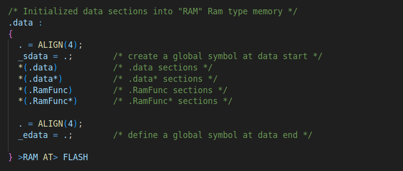

## Date: 2025-09-02

### Stage 0 — Preparation & Init

**Tasks & Results:**

* Added vendor system files:
  * `STM32F446RETX_FLASH.ld` (linker script for execution from Flash).
  * `startup_stm32f446retx.s` (startup assembly file with vector table and reset handler).
* Created `System/` directory to hold system-level sources.

**Next Steps:**

* Integrate system files into the build system (Makefile).
* Run a minimal test program on the board to validate toolchain + startup + linker script.
* Proceed with writing the project specification and requirements.

---

> **Linker Scripts Notes:**
> 
> * `STM32F446RETX_FLASH.ld` defines memory layout and section placement for Flash execution and RAM debugging.
> * Linker scripts specify **VMA (runtime address)** and **LMA (load address)** for `.text`, `.data`, `.bss`, `.rodata` sections.
> * Startup code handles copying `.data` from Flash to SRAM and zero-initialization of `.bss`.
> * Key directives included: `MEMORY` (regions), `ENTRY` (reset handler), `SECTIONS` (map input sections to memory), `KEEP` (prevent removal of vector table), `ALIGN`, `PROVIDE`, `AT>` (VMA/LMA mapping).
> * Scripts are vendor-provided. If a different memory layout or execution mode is required, custom linker scripts should be created from scratch.
>
> 
